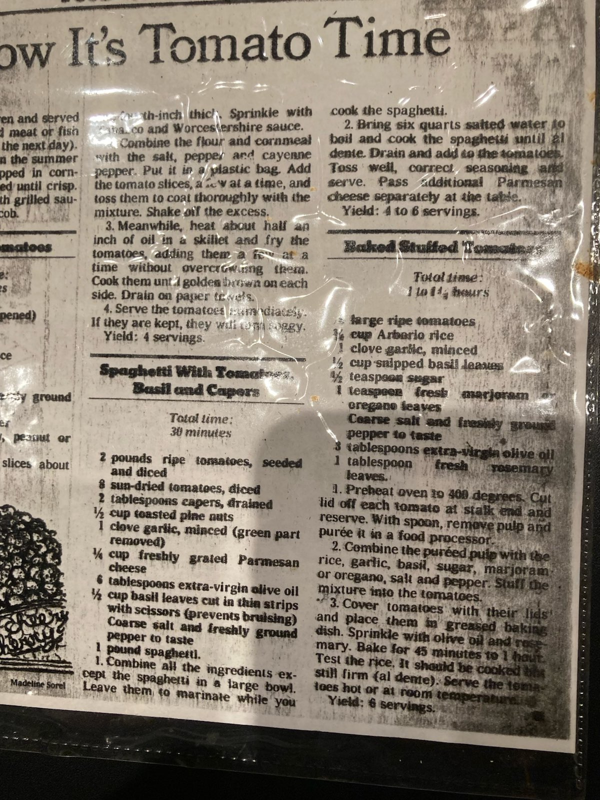

# No-Cook Pasta

- Serves: 4
- Prep Time: 20 minutes
- Cook Time: 10 minutes
- Total Time: 30 minutes

## Ingredients

- 2 pounds ripe tomatoes, seeded and diced
- 8 sun-dried tomatoes, diced
- 2 tablespoons capers, drained
- 1/2 cup roasted pine nuts
- 1 clove garlic, minced 
- 1/4 freshly grated Parmesan
- 6 tablespoons extra-virgin olive oil
- 1/2 cup basil leaves in thin strips with scissors (prevents bruising)
- Coarse salt and freshly ground pepper to taste
- 1 pound spaghetti
 
## Instructions

1. Combine all the ingredients except the spaghetti in a large bowl. Leave them to marinate while you cook the spaghetti
2. Bring six quarts salted water to boil and cook the spaghetti until al dente. Drain and add the tomatoes. Toss well, correct seasoning and serve. Pass additional parmesan cheese. 

## Notes

-

## Pictures

{:height="36px" width="36px"}
